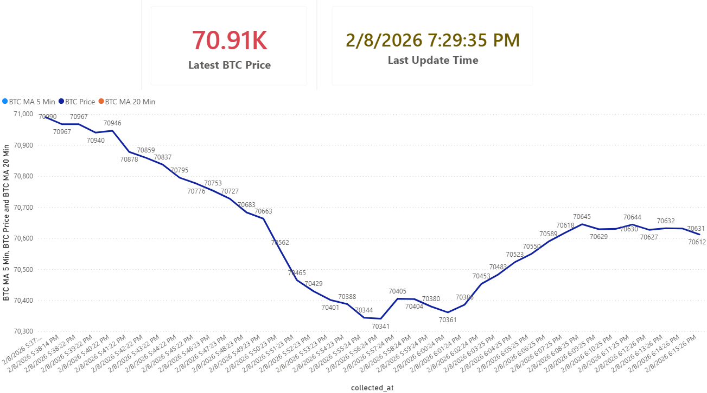

# 📈 BTC Real-Time Price Monitoring Dashboard

An end-to-end project demonstrating how to build a **real-time data pipeline** for cryptocurrency price monitoring, from API ingestion to SQL storage and business-ready visualization.

---

## 🚀 Project Overview

This project automatically collects real-time **Bitcoin (BTC)** price data at fixed intervals and stores it in a MySQL database.  
The data is then visualized in **Power BI**, enabling real-time monitoring of price movements and short-term trends.

The goal of this project is to showcase practical skills in:
- API data ingestion
- Database design
- Automation
- Business intelligence visualization

---

## 🧱 System Architecture

**Crypto API → Python → MySQL → Power BI**

1. **Data Ingestion**
   - Fetches real-time BTC price data from a public cryptocurrency API

2. **Backend Processing (Python)**
   - Scheduled data collection
   - Inserts timestamped records into MySQL

3. **Database Layer**
   - MySQL table storing historical BTC prices

4. **Visualization**
   - Power BI dashboard for real-time monitoring and analysis

---

## 🛠 Tech Stack

- **Python** (FastAPI, requests, threading)
- **MySQL**
- **Power BI**
- **Git & GitHub**

---

## 📊 Dashboard Preview



**Dashboard features:**
- BTC price trend (minute-level)
- 5-minute Moving Average (MA)
- 20-minute Moving Average (MA)
- Latest BTC price card
- Last update timestamp

---

## 📁 Project Structure

```text
BTC-Real-Time-Price-Monitoring/
│
├── main.py              # Application entry & scheduler
├── fetcher.py           # BTC price API fetch logic
├── db.py                # MySQL connection and insert logic
├── btc_price.sql        # Database schema
├── BTC_analysis.pbix    # Power BI dashboard file
├── btc_dashboard.png    # Dashboard preview image
└── README.md

## 👤 Author
Dylan Chien  
[LinkedIn](https://www.linkedin.com/in/dylan-chien-868a03135/)
