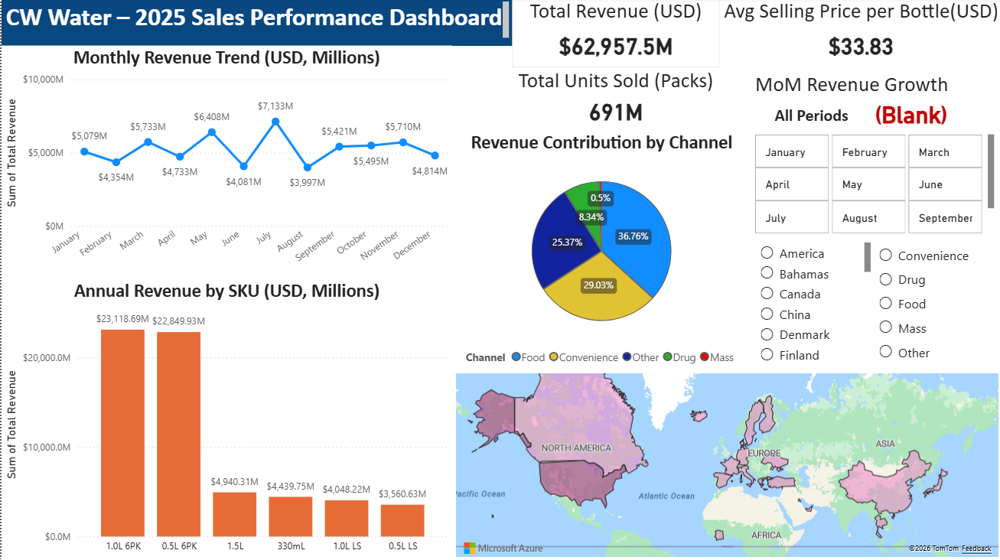

# CW Water Budget Analysis 2025 (Power BI)

## 📌 Project Overview
This project focuses on analyzing the 2025 global sales and budget projections for CW Water, an international bottled water company operating across multiple regions and sales channels.

The objective is to support budgeting, performance monitoring, and management decision-making by transforming raw sales projections into clear and interactive Power BI dashboards.

---

## 🎯 Business Questions
- How does sales volume and revenue distribute across regions and channels?
- What are the monthly seasonality patterns in 2025?
- Which SKUs contribute most to total revenue?
- How can management quickly assess budget performance at a global and regional level?

---

## 📊 Key Analysis & Dashboard Features
- Monthly sales volume trends by region
- Revenue breakdown by channel and SKU
- Seasonality analysis across all products
- Interactive filters for region, channel, and time
- High-level KPIs for management overview

---

## 🛠 Tools & Techniques
- Power BI (data modeling, DAX measures, interactive visuals)
- Microsoft Excel (source data preparation)
- Data cleaning and validation
- Dashboard design for business users

---

## 📂 Repository Structure
- `CW Water – 2025 Sales Performance.pbix` – Power BI dashboard file
- `CW Water – 2025 Sales Performance Screenshot.png` – Dashboard preview
- `Data.xlsx` – Source data
- `Cubewise Skill Test Level 1.pdf` – Case background and requirements

---

## 🖼 Dashboard Preview

---

## 🔍 Key Insights (Example)
- North America accounts for the majority of projected revenue.
- Sales volumes show clear monthly seasonality patterns.
- A small number of SKUs drive a significant share of total revenue.
- Interactive dashboards enable quick management-level analysis.

---

## 👤 Author
Dylan Chien  
[LinkedIn](https://www.linkedin.com/in/dylan-chien-868a03135/)
