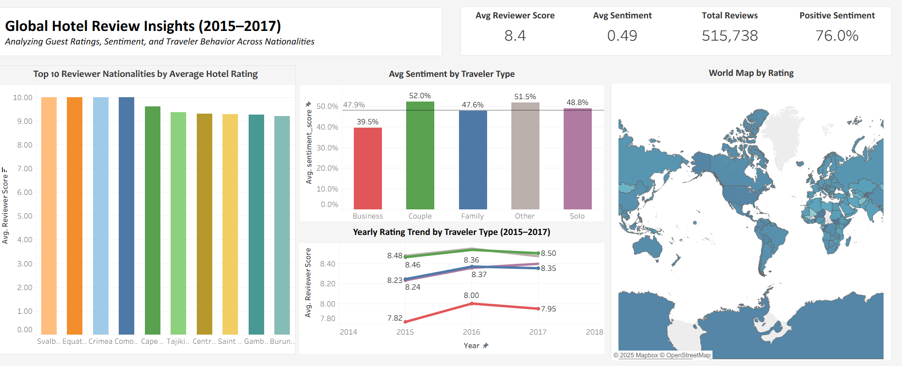

# 🏨 Hotel Review Analysis Dashboard

An end-to-end project analyzing **global hotel reviews (2015–2017)** using **Python, R, and Tableau**.  
It explores **guest ratings, sentiment, traveler types, and nationalities** to uncover what drives hotel satisfaction around the world.

---

## 🖼️ Dashboard Preview

> 🌐 [View Interactive Dashboard on Tableau Public](https://public.tableau.com/views/HotelReviewAnalysisDashboard_17629704612250/Dashboard1?:language=en-US&:sid=&:redirect=auth&:display_count=n&:origin=viz_share_link)

---

## 📊 Project Overview

This project demonstrates a complete analytics workflow — from **data cleaning** to **visual storytelling** — designed to identify traveler behavior and satisfaction patterns.  

Main objectives:
- Analyze global hotel satisfaction levels  
- Compare **traveler types** and **reviewer nationalities**  
- Perform **sentiment analysis** on textual reviews  
- Build an **interactive Tableau dashboard** for insights  

---

## 📁 Files Included

| File | Description |
|------|--------------|
| `Hotel Review Analysis Dashboard.twb` | Tableau dashboard (final visualization) |
| `Hotel Review Analysis_py.ipynb` | Python notebook for data cleaning and sentiment scoring |
| `Hotel Review Analysis_R.R` | R script for ANOVA and Tukey post-hoc tests |
| `dashboard_preview.png` | Dashboard preview image for GitHub display |

> *Data files are not included due to size limitations. The Tableau dashboard contains summarized outputs.*

---

## 🧠 Key Insights

- 💑 **Couple travelers** show the highest positive sentiment (~**52%**)  
- 💼 **Business travelers** rated hotels the lowest (avg. score **7.9–8.0**)  
- 🗓️ **Average hotel rating** remained stable between **8.2–8.5** (2015–2017)  
- 💬 **Overall positive sentiment:** ~**76%**, indicating strong global satisfaction  
- 🌍 Several nationalities consistently appear in the **Top 10 reviewers** with ratings above **9.0**

---

## ⚙️ Tools Used

| Tool | Purpose |
|------|----------|
| **Python (Pandas, VADER)** | Data cleaning and sentiment analysis |
| **R (tidyverse, stats)** | Statistical validation (ANOVA & Tukey HSD) |
| **Tableau Desktop** | Dashboard visualization and KPI design |
| **Excel** | Preliminary data validation and preparation |

---

## 📚 Data Source

The analysis is based on an open-access **Hotel Review Dataset (2015–2017)**,  
containing guest reviews, ratings, and traveler metadata collected from multiple hotel platforms.

📦 Dataset available on Kaggle:  
🔗 [https://www.kaggle.com/datasets/jiashenliu/515k-hotel-reviews-data-in-europe](https://www.kaggle.com/datasets/jiashenliu/515k-hotel-reviews-data-in-europe)

---

## ✨ Author

**Dylan Chien(DylanChien1996) **  
🎓 B.Sc. in Business Analytics – Uniwersytet Marii Curie-Skłodowskiej (UMCS)
📍 Lublin, Poland
🔗 [LinkedIn](https://www.linkedin.com/in/dylan-chien-868a03135) | [GitHub Portfolio](https://github.com/DylanChien1996)

---

