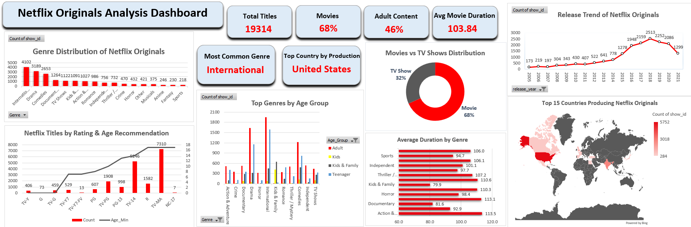

# 🎬 Netflix Originals Analysis Dashboard

An end-to-end data visualization project analyzing **Netflix Originals (2018–2024)** using **Excel (Power Query + PivotCharts)**.  
The dashboard explores **genre trends, audience age groups, movie vs. TV ratio, global production patterns, and content maturity levels** to uncover how Netflix creates and distributes original content worldwide.

---

## 🖼️ Dashboard Preview

---

## 📊 Project Overview

This project demonstrates a complete analytics workflow — from **data cleaning** to **dashboard design** — built entirely inside Excel using **Power Query**, **PivotTables**, and **KPI cards**.

Main objectives:
- Analyze Netflix’s growth in content production  
- Understand **genre distribution** and **international content trends**  
- Compare **Movies vs. TV Shows**  
- Examine **age ratings** and audience recommendations  
- Identify **top-producing countries**  
- Build an **interactive, visually polished dashboard**

---

## 📁 Files Included

| File | Description |
|------|--------------|
| `netflix_dashboard.xlsx` | Excel dashboard (final visualization with KPIs + charts) |
| `netflix_titles.csv` | Original dataset used for analysis |
| `dashboard_preview.png` | Dashboard preview image for GitHub display |

> *All data transformations (genre expansion, duration cleaning, rating mapping, country processing) are included inside the Excel file via Power Query.*

---

## 🧠 Key Insights

- 🎬 **Movies account for ~68%** of all Netflix Originals  
- 🧑‍💼 **Adult-targeted content** makes up roughly **46%** of titles  
- 🌎 **International** is the most common genre category  
- 🇺🇸 **United States** remains the top content-producing country  
- ⏱️ Average movie duration is **103.8 minutes**  
- 📈 Netflix production surged sharply between **2005–2021** before stabilizing  
- 👶 Teenagers prefer **Drama, International, Action**, while Kids favor **Animation & Kids/Family**  
- 🌍 Global production is concentrated in **~15 key countries**

---

## ⚙️ Tools Used

| Tool | Purpose |
|------|----------|
| **Excel Power Query** | Data cleaning, splitting genres, duration standardization |
| **Excel PivotTables** | Data modeling and aggregation |
| **PivotCharts & Slicers** | Interactive visualizations |
| **Excel Dashboard Design** | KPI cards, layout, formatting |

---

## 📚 Data Source

This dashboard is built using the publicly available **Netflix Movies and TV Shows Dataset**, which includes attributes such as type, rating, duration, release year, and genres.

📦 Dataset available on Kaggle:  
🔗 https://www.kaggle.com/datasets/shivamb/netflix-shows

---

## ✨ Author

**Dylan Chien(DylanChien1996) **  
🎓 B.Sc. in Business Analytics – Uniwersytet Marii Curie-Skłodowskiej (UMCS)
📍 Lublin, Poland
🔗 [LinkedIn](https://www.linkedin.com/in/dylan-chien-868a03135) | [GitHub Portfolio](https://github.com/DylanChien1996)
